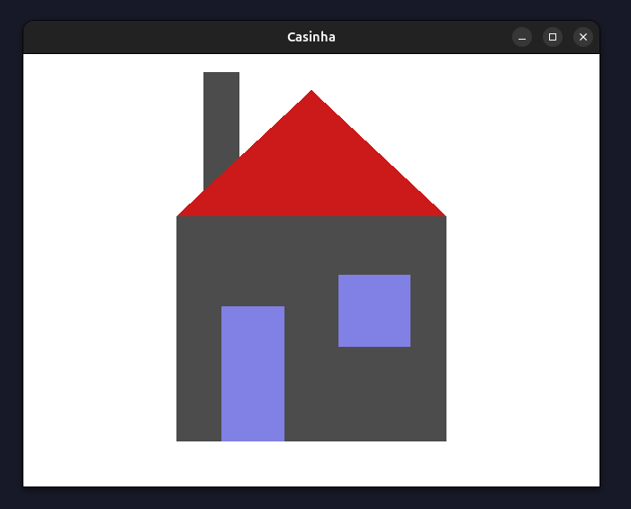

# Computer Graphics

Computer Graphics course at Londrina State University, taught by Prof. Dr. Gilberto Fernandes Jr.

This repository contains exercises and assignments from the course, all of which were developed entirely by me without AI-generated code.

Questions or suggestions are welcome.

# Exercises

## [Silly House](../src/silly_house/)

A simple test program to demonstrate basic 2D drawing with OpenGL.

This project is an example of how to use the OpenGL API with the FreeGLUT library. It includes a Makefile based on an example from lazyfoo.net and can be compiled on any Linux machine with g++, OpenGL, and FreeGLUT installed.

## [Paint Alpha](../src/paint_alpha/)

In progress ...
